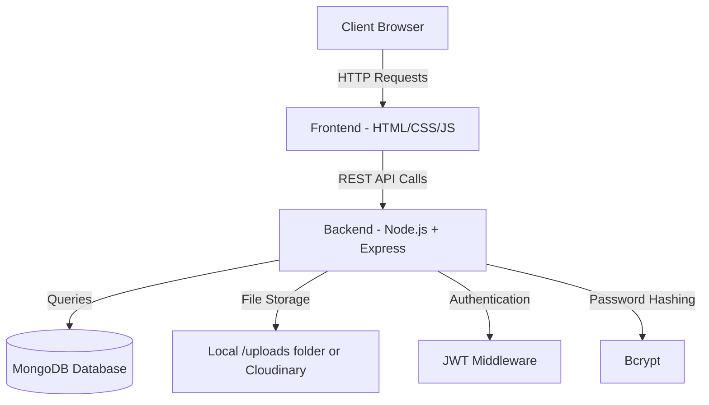
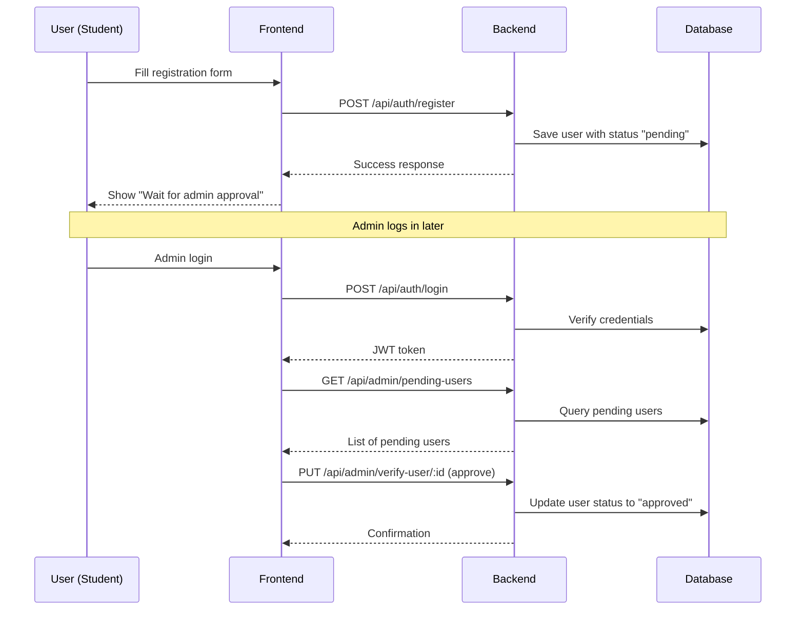
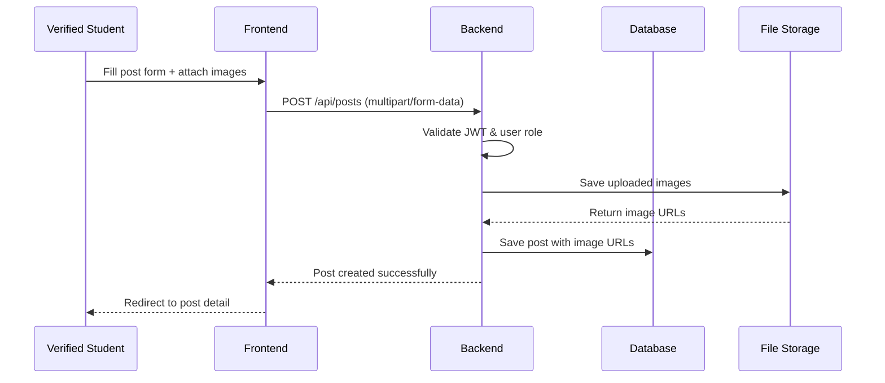
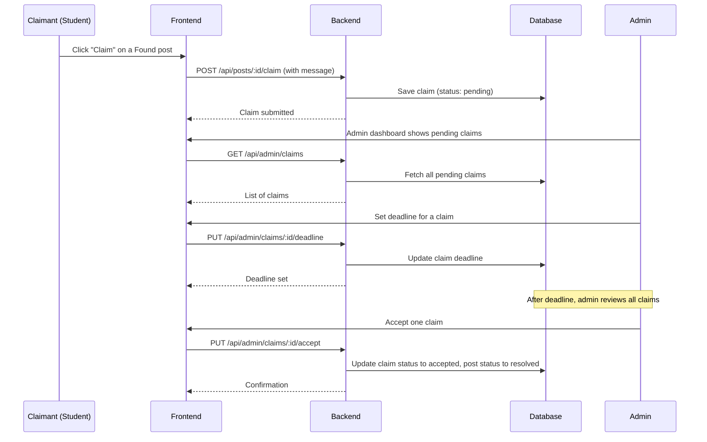
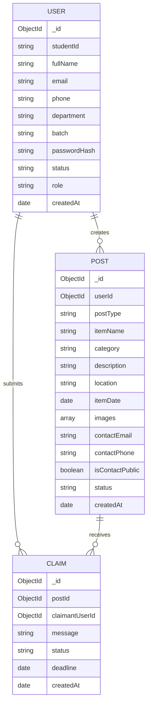
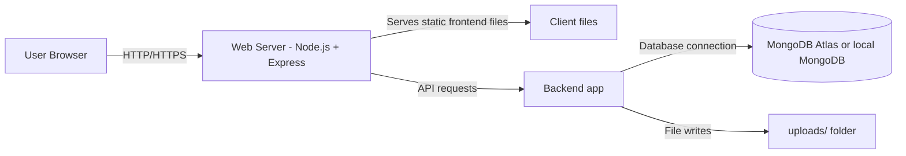

# 🏗️ System Architecture Document  
**Project:** Campus Lost & Found Management System  
**Version:** 1.0  
**Document Type:** Architecture.md  

---

## 1. Introduction

This document describes the overall system architecture of the **Campus Lost & Found Management System**. It outlines the high-level components, their interactions, data flow, and the technology stack used. The architecture follows a typical **three-tier web application** pattern, suitable for a university lab project.

---

## 2. High-Level Architecture Overview

The system is designed as a **client-server web application** with a clear separation between the frontend, backend, and database layers. The architecture ensures modularity, maintainability, and ease of development for a student team.

*Fig. 1 – High-level three-tier architecture*

---

## 3. Architectural Layers

### 3.1 Presentation Layer (Frontend)
- **Technology:** HTML5, CSS3, JavaScript (optionally React for component-based UI, but plain JS is sufficient for this project)
- **Responsibility:**
  - Renders all user interfaces (home page, post detail, dashboard, admin panel)
  - Handles client-side form validation and user input
  - Makes asynchronous API calls using `fetch` or `axios`
  - Displays data received from the backend
  - Manages user session using JWT stored in `localStorage`

### 3.2 Application Layer (Backend)
- **Technology:** Node.js with Express.js framework
- **Responsibility:**
  - Exposes RESTful API endpoints
  - Implements business logic (registration, posting, claiming, verification)
  - Handles authentication and authorization via JWT
  - Validates incoming data (server-side validation)
  - Manages file uploads (Multer middleware)
  - Communicates with the database using Mongoose ODM

### 3.3 Data Layer (Database)
- **Technology:** MongoDB (NoSQL document database) with Mongoose
- **Responsibility:**
  - Stores all persistent data: users, posts, claims, notifications
  - Enforces data integrity through schema definitions
  - Supports indexing for faster search queries (e.g., on `category`, `location`, `postType`)

### 3.4 External Services (Optional)
- **Email Service:** For sending verification or notification emails (can be integrated later; not mandatory in basic version)
- **Cloud Storage:** For storing uploaded images (Cloudinary or similar; initially local file system is enough)

---

## 4. Component Interaction & Data Flow

### 4.1 User Registration and Verification Flow

### 4.2 Post Creation Flow

### 4.3 Claim and Admin Resolution Flow

---

## 5. Database Schema (Simplified)

Three main collections are used. The relationships are shown in the following entity diagram:

*Note:* The `NOTIFICATION` collection is optional and can be added later.

---

## 6. API Design

The backend follows RESTful conventions. All routes are prefixed with `/api`.

| Method | Endpoint | Description | Access |
|--------|----------|-------------|--------|
| POST | `/api/auth/register` | Register new user | Public |
| POST | `/api/auth/login` | Login user | Public |
| GET | `/api/auth/me` | Get current user profile | Private (JWT) |
| GET | `/api/posts` | Get all posts (with filters) | Public |
| GET | `/api/posts/:id` | Get single post detail | Public |
| POST | `/api/posts` | Create new post | Verified Student |
| PUT | `/api/posts/:id` | Update own post | Post Owner |
| DELETE | `/api/posts/:id` | Delete own post | Post Owner |
| POST | `/api/posts/:id/claim` | Submit a claim | Verified Student |
| GET | `/api/admin/pending-users` | List pending users | Admin |
| PUT | `/api/admin/verify-user/:id` | Approve/Reject user | Admin |
| GET | `/api/admin/claims` | List all claims | Admin |
| PUT | `/api/admin/claims/:id/deadline` | Set claim deadline | Admin |
| PUT | `/api/admin/claims/:id/accept` | Accept a claim | Admin |
| DELETE | `/api/admin/posts/:id` | Delete any post | Admin |

---

## 7. Security Architecture

- **Authentication:** JWT (JSON Web Tokens) stored in `localStorage`; tokens expire after 24 hours.
- **Password Security:** Passwords are hashed using `bcrypt` with salt rounds.
- **Authorization:** Middleware checks user role (`student` or `admin`) before allowing access to protected routes.
- **Input Validation:** All inputs are validated on both client and server side to prevent XSS and injection attacks.
- **File Upload Security:** Only image files (jpg, png) are accepted; file size limited to 2MB; random file names are used to prevent path traversal.
- **Privacy Controls:** Contact information can be marked private; only authenticated verified users can view private contact details.

---

## 8. Deployment Architecture (Simple)

For the university lab project, a simple single-server deployment is sufficient:

*Alternatively, frontend and backend can be hosted separately on Vercel/Netlify and Render/Heroku, but a single Node.js server is simpler for demo.*

---

## 9. Technology Stack Summary

| Layer | Technology | Justification |
|-------|------------|----------------|
| Frontend | HTML, CSS, JavaScript (vanilla) | Simple, no build tools required |
| Backend | Node.js, Express | Lightweight, fast, easy for students |
| Database | MongoDB + Mongoose | Flexible schema, popular in MERN stack |
| Authentication | JWT, bcrypt | Industry-standard, secure |
| File Upload | Multer | Easy integration with Express |
| Version Control | Git & GitHub | Team collaboration |

---

## 10. Future Architectural Enhancements

- Separate frontend into a React SPA for better state management.
- Introduce a microservices architecture if the system grows (not needed now).
- Implement WebSocket for real-time notifications.
- Use cloud storage (AWS S3 or Cloudinary) for images to scale.
- Add a caching layer (Redis) for frequently accessed posts.

---
